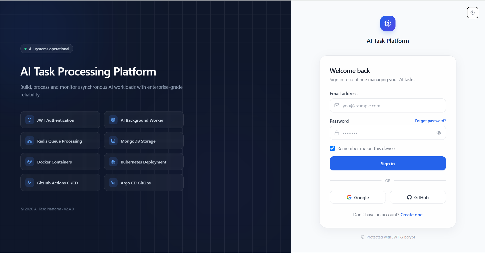
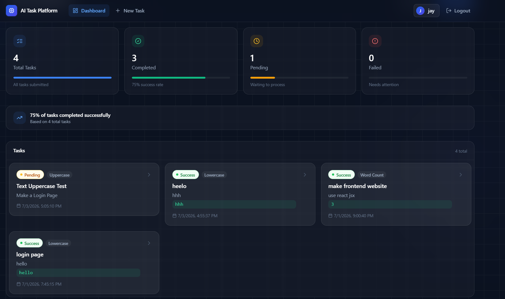
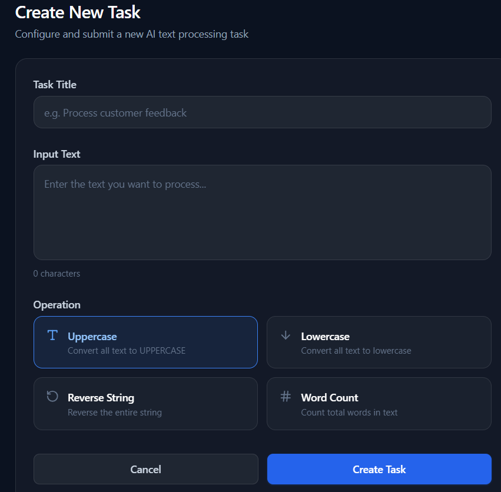
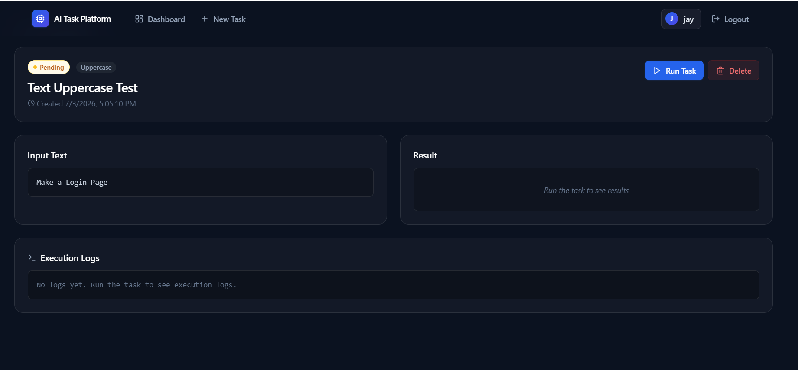
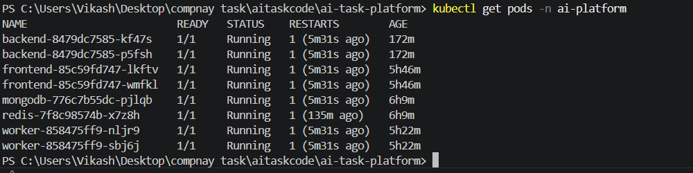
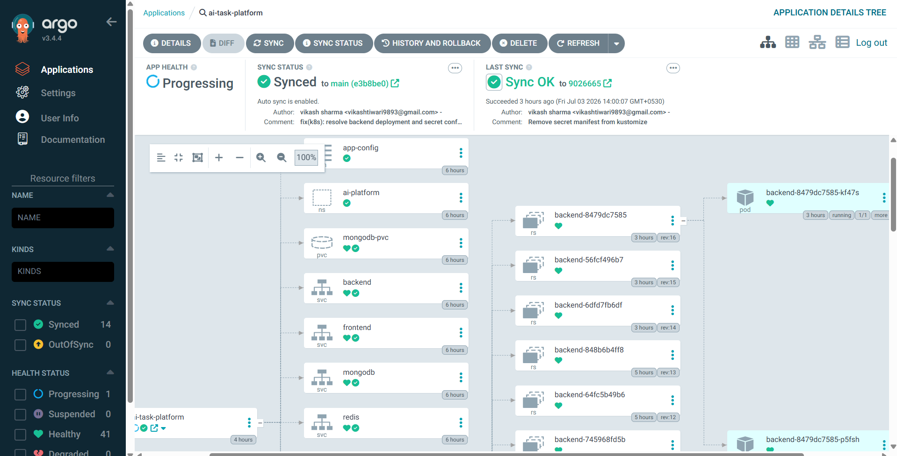

# 🚀 AI Task Processing Platform

<p align="center">
  
  
  
  
  
  
  
</p>

A production-oriented **AI Task Processing Platform** built with the **MERN stack**, a **Python worker**, **Redis** for queuing, and deployed via **Docker + Kubernetes** using **GitOps (Argo CD)** and a **GitHub Actions CI/CD pipeline**.

Authenticated users can create text-processing tasks, run them asynchronously through a Redis-backed queue and Python worker, and monitor status, execution logs, and results in real time.

---

## 📑 Table of Contents

- [Features](#-features)
- [Task Processing Workflow](#-task-processing-workflow)
- [System Architecture](#-system-architecture)
- [Technology Stack](#-technology-stack)
- [Repository Structure](#-repository-structure)
- [Local Setup](#-local-setup)
- [Environment Variables](#-environment-variables)
- [Docker](#-docker)
- [Kubernetes Deployment](#-kubernetes-deployment)
- [GitOps with Argo CD](#-gitops-with-argo-cd)
- [CI/CD Pipeline](#-cicd-pipeline)
- [Security](#-security)
- [REST API Reference](#-rest-api-reference)
- [Screenshots](#-screenshots)
- [Assumptions](#-assumptions)
- [Infrastructure Components](#-infrastructure-components)
- [Future Improvements](#-future-improvements)
- [Author](#-author)
- [License](#-license)

---

## ✨ Features

### 🔐 Authentication
- User registration & login
- JWT-based authentication
- bcrypt password hashing
- Protected API routes

### 🤖 AI Task Processing
- Create tasks with title, input text, and operation type
- Run tasks asynchronously via Redis queue
- Real-time status tracking
- View execution logs and results

### Supported Operations
| Operation | Description |
|---|---|
| Uppercase | Converts all characters to uppercase |
| Lowercase | Converts all characters to lowercase |
| Reverse String | Reverses the input text |
| Word Count | Returns total word count |

---

## ⚙️ Task Processing Workflow

```text
User → React Frontend → Express Backend → MongoDB (task saved as "Pending")
                                              │
                                              ▼
                                        Redis Queue
                                              │
                                              ▼
                                       Python Worker
                                              │
                                              ▼
                              MongoDB updated → "Running" → "Success/Failed"
                                              │
                                              ▼
                                    Frontend Dashboard (live status)
```

**Status Flow:** `Pending → Running → Success / Failed`

---

## 🏗 System Architecture

```text
                        ┌─────────────────┐
                        │  React Frontend │
                        └────────┬────────┘
                                 │ REST API
                        ┌────────▼────────┐
                        │ Express Backend │
                        └───┬─────────┬───┘
                            │         │
                  ┌─────────▼──┐   ┌──▼──────────┐
                  │  MongoDB   │   │ Redis Queue │
                  └────────────┘   └──────┬──────┘
                                          │
                                   ┌──────▼───────┐
                                   │ Python Worker│
                                   └──────────────┘
```

> Full architecture details — worker scaling, high-volume task handling (~100k/day), MongoDB indexing, and Redis failure recovery — are covered in [`ARCHITECTURE.pdf`](./ARCHITECTURE.pdf).

---

## 🛠 Technology Stack

| Layer | Technology |
|---|---|
| Frontend | React.js, Vite, Tailwind CSS |
| Backend | Node.js, Express.js |
| Worker | Python |
| Database | MongoDB |
| Queue | Redis |
| Authentication | JWT, bcrypt |
| Containerization | Docker (multi-stage builds) |
| Orchestration | Kubernetes (k3d / minikube) |
| GitOps | Argo CD |
| CI/CD | GitHub Actions |

---

## 📁 Repository Structure

**Application Repository**
```
ai-task-platform/
├── backend/
├── frontend/
├── worker/
├── docker-compose.yml
├── README.md
├── ARCHITECTURE.pdf
└── screenshots/
```

**Infrastructure Repository**
```
ai-task-platform-infra/
├── argocd/
├── k8s/
│   ├── base/
│   └── overlays/
└── README.md
```

---

## 🚀 Local Setup

### Prerequisites
- Node.js 18+
- Python 3.10+
- Docker Desktop
- MongoDB (local instance or Atlas)
- Redis (local instance)

### Clone Repository
```bash
git clone https://github.com/<your-username>/ai-task-platform.git
cd ai-task-platform
```

### Backend
```bash
cd backend
npm install
npm run dev
```

### Frontend
```bash
cd frontend
npm install
npm run dev
```

### Worker
```bash
cd worker
python -m venv venv
venv\Scripts\activate      # Windows
# source venv/bin/activate  # macOS/Linux
pip install -r requirements.txt
python -m src.worker
```

---

## 🔐 Environment Variables

Copy `.env.example` to `.env` in each service directory and fill in the values below. **Never commit `.env` files.**

**Backend** (`backend/.env`)
```env
PORT=5000
NODE_ENV=production
MONGO_URI=
JWT_SECRET=
REDIS_HOST=
REDIS_PORT=
```

**Worker** (`worker/.env`)
```env
MONGO_URI=
REDIS_HOST=
REDIS_PORT=
```

**Frontend** (`frontend/.env`)
```env
VITE_API_URL=http://localhost:5000/api
```

> ⚠️ Backend and Worker must point to the **same** `MONGO_URI` and `REDIS_HOST`/`REDIS_PORT` — otherwise queued tasks won't be found by the worker.

---

## 🐳 Docker

```bash
# Build all images
docker compose build

# Run all services
docker compose up -d

# Stop all services
docker compose down
```

Each service (`frontend`, `backend`, `worker`) has its own multi-stage `Dockerfile` and runs as a **non-root user**.

---

## ☸ Kubernetes Deployment

```bash
# Apply manifests (staging overlay example)
kubectl apply -k k8s/overlays/staging

# Check pods
kubectl get pods -n ai-platform

# Check services
kubectl get svc -n ai-platform

# Check deployments
kubectl get deployments -n ai-platform
```

---

## 🚀 GitOps with Argo CD

This project follows GitOps principles — the Infrastructure Repository is the single source of truth for cluster state.

```text
Git Push → Infra Repository → Argo CD detects change → Auto-Sync → Cluster updated
```

Auto-Sync is enabled for the `ai-task-platform` Argo CD application, so any manifest change merged to `main` is automatically reconciled to the cluster.

---

## ⚡ CI/CD Pipeline (GitHub Actions)

```text
Git Push
  → Install Dependencies
  → Run Lint
  → Run Tests
  → Build Docker Images
  → Push Images to Docker Hub
  → Update Image Tags in Infrastructure Repository
  → Argo CD Auto-Sync
  → Deployed to Kubernetes
```

---

## 🔒 Security

- JWT authentication
- bcrypt password hashing
- Helmet middleware
- API rate limiting
- Kubernetes Secrets for sensitive config
- No hardcoded credentials in source
- Non-root Docker containers
- Multi-stage Docker builds (smaller attack surface)

---

## 📡 REST API Reference

**Authentication**

| Method | Endpoint | Description |
|---|---|---|
| POST | `/api/auth/register` | Register a new user |
| POST | `/api/auth/login` | Login and receive JWT |

**Tasks**

| Method | Endpoint | Description |
|---|---|---|
| GET | `/api/tasks` | List all tasks for the authenticated user |
| POST | `/api/tasks` | Create a new task |
| GET | `/api/tasks/:id` | Get task details |
| POST | `/api/tasks/:id/run` | Run/queue a task |
| DELETE | `/api/tasks/:id` | Delete a task |

---

## 📷 Screenshots

| | |
|---|---|
| **Login Page** |  |
| **Dashboard** |  |
| **Create Task** |  |
| **Task Processing (Success)** |  |
| **Kubernetes Pods** |  |
| **Argo CD Dashboard** |  |
| **GitHub Actions Pipeline** |  |

> Place the corresponding image files inside the `screenshots/` folder using the filenames above (or update the paths to match your actual files).

---

## 📝 Assumptions

- MongoDB is used as the primary database (local instance for development/demo; Atlas-compatible for production).
- Redis is used as the task queue between backend and worker.
- Docker Hub is used as the container image registry.
- Kubernetes Secrets manage all sensitive configuration; no secrets are committed to source control.
- GitHub Actions automates linting, testing, building, and pushing images.
- Argo CD continuously reconciles the cluster state from the Infrastructure Repository.
- This project was built as part of a MERN Full Stack Developer technical assessment.

---

## 📂 Infrastructure Components

- ✅ Dedicated Namespace
- ✅ ConfigMaps
- ✅ Secrets
- ✅ MongoDB Deployment
- ✅ Redis Deployment
- ✅ Backend Deployment
- ✅ Frontend Deployment
- ✅ Worker Deployment (horizontally scalable)
- ✅ Services
- ✅ Ingress
- ✅ Persistent Volume Claim (PVC)
- ✅ Horizontal Pod Autoscaler (HPA)
- ✅ Kustomize Base & Overlays
- ✅ Argo CD Applications
- ✅ GitHub Actions CI/CD

---

## 📈 Future Improvements

- Email verification & password reset flow
- Automatic retry for failed tasks
- Prometheus + Grafana monitoring
- OpenTelemetry distributed tracing
- Centralized logging (ELK stack)
- HTTPS-enabled Ingress with cert-manager
- Role-Based Access Control (RBAC)

---

## 👨‍💻 Author

**Vikash Sharma (Jay)**
MERN Full Stack Developer & Agentic AI Engineer

React.js · Node.js · Express.js · MongoDB · Python · Docker · Kubernetes · Argo CD · GitHub Actions

---

## 📄 License

This project was developed as part of a MERN Full Stack Developer Technical Assessment and is intended solely for evaluation and educational purposes.